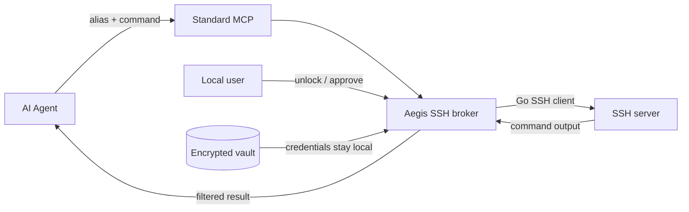

<div align="center">

# Aegis SSH

### Let AI agents operate your servers without handing over your SSH secrets.

[](https://github.com/taotecode/aegis-ssh/actions/workflows/ci.yml)
[](https://github.com/taotecode/aegis-ssh/releases/latest)
[](LICENSE)
[](go.mod)
[](#installation)

[Quick start](#quick-start) · [How it works](#how-it-works) · [Security](#security-boundary) · [Documentation](#documentation) · [简体中文](README.zh-CN.md)

</div>

---

AI coding agents are useful on remote servers, but putting an SSH password, private key, host, or username into a prompt or MCP configuration creates a new disclosure path. **Aegis SSH keeps those details in a local encrypted vault and gives the agent only a public alias such as `prod`.**

The agent asks Aegis SSH to run a command. A local broker authenticates, evaluates risk, requests local approval when needed, filters output, and records an audit trail. Credentials never become tool arguments or model context.

## What stays private

| The agent can see | The local broker keeps |
| --- | --- |
| Public aliases and descriptions | Hosts, ports, usernames, and host fingerprints |
| Exact command it requested | SSH passwords and imported private keys |
| Filtered stdout/stderr | Private-key passphrases and master-password material |
| Risk result and redaction markers | Encrypted vault contents and recovery material |

## Highlights

- **Credential isolation** - password and private-key authentication stay behind a local Unix socket.
- **Local approval** - risky requests wait for `approval approve|deny`; no approval codes pollute agent chat.
- **Three risk modes** - choose `enforce`, `warn`, or `off` without disabling credential isolation, host-key checks, or audit.
- **Fleet execution** - run one command concurrently across named aliases or every configured server.
- **Background lifecycle** - `start`, `stop`, `lock`, `unlock`, status reporting, and optional launchd/systemd login service.
- **Operational visibility** - structured JSONL logs, configurable levels, bounded output, redaction, and audit records.
- **Recovery and local reveal** - opt in to an offline recovery code; reveal a stored server password only after local master-password verification.
- **One portable binary** - macOS and Linux builds for amd64 and arm64, with English and Chinese CLI output.

## How it works



The broker is deliberately small: one Go binary owns the decrypted vault and SSH connections. MCP clients receive aliases and filtered command results, never connection fields.

## Quick start

### 1. Installation

Install the latest checksum-verified GitHub Release and configure every detected Agent:

```bash
curl -fsSL https://raw.githubusercontent.com/taotecode/aegis-ssh/main/scripts/install.sh | sh
```

Update or uninstall with the same script:

```bash
curl -fsSL https://raw.githubusercontent.com/taotecode/aegis-ssh/main/scripts/install.sh | sh -s -- update
curl -fsSL https://raw.githubusercontent.com/taotecode/aegis-ssh/main/scripts/install.sh | sh -s -- uninstall
```

The installer supports macOS and Linux on amd64 and arm64. When needed, it adds `~/.local/bin` to your shell startup file; open a new terminal after the first installation. It does not initialize or read `~/.aegis-ssh`; normal uninstall preserves encrypted user data.

### 2. Enroll a server

```bash
aegis-ssh init
aegis-ssh server add
aegis-ssh server test <alias>
aegis-ssh recovery enable   # store the displayed code offline
```

Enrollment is an interactive six-step wizard. Port `22` and common private-key paths have sensible defaults. Connection fields and credentials are read only from `/dev/tty`; verify the presented host-key fingerprint through a trusted channel before accepting it.

### 3. Start the broker

```bash
aegis-ssh start
aegis-ssh status
```

Enter the master password at the hidden prompt. The terminal can be closed after startup.

### 4. Connect an agent

Installation automatically configures detected Codex, Claude Code, Gemini CLI, Cursor, VS Code, and OpenClaw clients. Check or repair integrations at any time:

| Agent | Integration | Automatic setup |
|---|---|---|
| Codex | MCP + Skill | Native `codex mcp` CLI |
| Claude Code | MCP + Skill | Native `claude mcp` CLI, user scope |
| Gemini CLI | MCP + Skill | Native `gemini mcp` CLI, user scope |
| Cursor | MCP | Safely merges `~/.cursor/mcp.json` |
| VS Code | MCP | Native `code --add-mcp`; default-profile status/removal |
| OpenClaw | Skill + CLI fallback | Managed Skill under `~/.openclaw/skills` |

```bash
aegis-ssh agent status
aegis-ssh agent configure auto
```

Restart the Agent, then ask by alias:

```text
Use Aegis SSH to run `uptime` on prod.
Use Aegis SSH to run `df -h` on prod and staging.
```

MCP examples for Codex, Claude Code, Gemini CLI, Cursor, and VS Code are under [`examples/mcp/`](examples/mcp/). OpenClaw uses the installed Skill and CLI fallback because it is not an MCP client.

## Everyday commands

```bash
# Lifecycle
aegis-ssh start
aegis-ssh lock
aegis-ssh unlock
aegis-ssh stop

# Server management
aegis-ssh server list
aegis-ssh server show prod
aegis-ssh server edit prod
aegis-ssh server password prod     # master password required; /dev/tty only

# Execution
aegis-ssh exec prod -- 'uptime'
aegis-ssh exec --servers prod,staging -- 'df -h'
aegis-ssh exec --all -- 'uname -a'

# Policy, approvals, and diagnostics
aegis-ssh config set risk-policy enforce   # enforce | warn | off
aegis-ssh config set log-level info        # debug | info | warn | error | off
aegis-ssh approval list
aegis-ssh log follow
```

## Recovery

Enable recovery **before** losing the master password and store the displayed recovery code offline:

```bash
aegis-ssh recovery enable
aegis-ssh recovery restore
```

`restore` resets the master password while preserving configured servers. A legacy vault without recovery cannot be decrypted after its master password is lost; `aegis-ssh recovery reset` archives the unreadable encrypted files and creates a new empty vault.

## Security boundary

Aegis SSH provides credential isolation, pinned SSH host keys, local approvals, best-effort command-risk analysis, output redaction, and audit logging. It is **not a remote shell sandbox**. An agent allowed to execute arbitrary shell commands may evade static analysis or encode data in a form the output filter does not recognize.

A malicious process running as the same local OS user may inspect process memory or interact with user-owned files and sockets. Use a separate OS account or stronger host isolation when that threat is in scope. Read [SECURITY.md](SECURITY.md) before production use.

## Documentation

| Guide | English | 简体中文 |
| --- | --- | --- |
| Add, edit, test, and remove servers | [Server setup](docs/server-setup.md) | [服务器配置](docs/server-setup.zh-CN.md) |
| Configure Codex and other agents | [Agent usage](docs/agent-usage.md) | [Agent 使用指南](docs/agent-usage.zh-CN.md) |
| Lifecycle, services, logs, and recovery | [Operations](docs/operations.md) | [运维指南](docs/operations.zh-CN.md) |
| Threat model and disclosure policy | [Security](SECURITY.md) | [安全说明](SECURITY.zh-CN.md) |

## Development

```bash
go test ./...
go test -race ./...
go vet ./...
scripts/package.sh ./dist
```

Releases are built and checksum-verified by GitHub Actions for macOS and Linux on amd64 and arm64.

## License

[Apache License 2.0](LICENSE)
