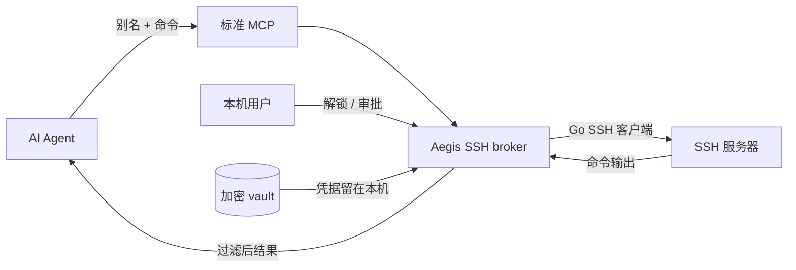

<div align="center">

# Aegis SSH

### 让 AI Agent 操作你的服务器，但不把 SSH 凭据交给 Agent。

[](https://github.com/taotecode/aegis-ssh/actions/workflows/ci.yml)
[](https://github.com/taotecode/aegis-ssh/releases/latest)
[](LICENSE)
[](go.mod)
[](#安装)

[快速开始](#快速开始) · [工作原理](#工作原理) · [安全边界](#安全边界) · [文档](#文档) · [English](README.md)

</div>

---

AI 编程 Agent 可以帮你运维远程服务器，但把 SSH 密码、私钥、地址或用户名放进提示词和 MCP 配置，会创造新的泄露路径。**Aegis SSH 将这些信息保存在本机加密 vault 中，Agent 只能看到 `prod` 这样的公开别名。**

Agent 向 Aegis SSH 请求执行命令；本机 broker 负责 SSH 认证、风险分析、本机审批、输出过滤和审计记录。凭据不会变成工具参数，也不会进入模型上下文。

## 什么信息会被隔离

| Agent 可以看到 | 本机 broker 保管 |
| --- | --- |
| 公开别名和描述 | 主机、端口、用户名和主机指纹 |
| Agent 请求的命令 | SSH 密码和已导入私钥 |
| 过滤后的 stdout/stderr | 私钥口令和主密码材料 |
| 风险结果和脱敏标记 | 加密 vault 和恢复材料 |

## 核心能力

- **凭据隔离**：密码和私钥认证都留在本机 Unix socket 之后。
- **本机审批**：风险请求等待 `approval approve|deny`，不再用批准码污染 Agent 对话。
- **三档风险策略**：可切换 `enforce`、`warn` 或 `off`，凭据隔离、主机指纹和审计始终生效。
- **多服务器并发**：对指定别名或全部服务器并发执行同一命令。
- **后台生命周期**：支持 `start`、`stop`、`lock`、`unlock`、状态查询和 launchd/systemd 登录服务。
- **可观测与审计**：结构化 JSONL 日志、日志级别、输出上限、脱敏和审计记录。
- **恢复与本机查密码**：可预先生成离线恢复码；验证主密码后才能在真实终端查看服务器密码。
- **单一便携二进制**：支持 macOS/Linux 的 amd64/arm64，CLI 可自动切换中英文。

## 工作原理



broker 刻意保持轻量：一个 Go 二进制管理解密后的 vault 和 SSH 连接。MCP 客户端只能获得公开别名和经过过滤的命令结果。

## 快速开始

### 1. 安装

安装最新且经过 checksum 校验的 GitHub Release，并自动配置检测到的 Agent：

```bash
curl -fsSL https://raw.githubusercontent.com/taotecode/aegis-ssh/main/scripts/install.sh | sh
```

使用同一脚本更新或卸载：

```bash
curl -fsSL https://raw.githubusercontent.com/taotecode/aegis-ssh/main/scripts/install.sh | sh -s -- update
curl -fsSL https://raw.githubusercontent.com/taotecode/aegis-ssh/main/scripts/install.sh | sh -s -- uninstall
```

安装器支持 macOS/Linux 的 amd64 和 arm64。需要时会自动将 `~/.local/bin` 写入 shell 启动文件；首次安装后重新打开终端即可。它不会初始化或读取 `~/.aegis-ssh`；普通卸载会保留加密用户数据。

### 2. 添加服务器

```bash
aegis-ssh init
aegis-ssh server add
aegis-ssh server test <别名>
aegis-ssh recovery enable   # 将显示的恢复码离线保存
```

添加过程是六步交互式向导，端口 `22` 和常见私钥路径已有默认值。连接信息和凭据只从 `/dev/tty` 读取；接受主机指纹前，必须通过可信渠道核对。

### 3. 启动 broker

```bash
aegis-ssh start
aegis-ssh status
```

在隐藏提示中输入主密码。启动后即可关闭终端。

### 4. 连接 Agent

安装时会自动配置检测到的 Codex、Claude Code、Gemini CLI、Cursor、VS Code 和 OpenClaw。可随时检查或修复：

| Agent | 集成方式 | 自动配置方式 |
|---|---|---|
| Codex | MCP + Skill | 原生 `codex mcp` CLI |
| Claude Code | MCP + Skill | 原生 `claude mcp` CLI，用户级配置 |
| Gemini CLI | MCP + Skill | 原生 `gemini mcp` CLI，用户级配置 |
| Cursor | MCP | 安全合并 `~/.cursor/mcp.json` |
| VS Code | MCP | 原生 `code --add-mcp`；默认 profile 状态检查和卸载 |
| OpenClaw | Skill + CLI fallback | 托管至 `~/.openclaw/skills` |

```bash
aegis-ssh agent status
aegis-ssh agent configure auto
```

重启 Agent，然后只需指定别名：

```text
使用 Aegis SSH 在 prod 上执行 `uptime`。
使用 Aegis SSH 在 prod 和 staging 上执行 `df -h`。
```

Codex、Claude Code、Gemini CLI、Cursor 和 VS Code 的 MCP 示例位于 [`examples/mcp/`](examples/mcp/)。OpenClaw 不是 MCP 客户端，使用自动安装的 Skill 和 CLI fallback。

## 常用命令

```bash
# 生命周期
aegis-ssh start
aegis-ssh lock
aegis-ssh unlock
aegis-ssh stop

# 服务器管理
aegis-ssh server list
aegis-ssh server show prod
aegis-ssh server edit prod
aegis-ssh server password prod     # 需要主密码，只输出到 /dev/tty

# 执行命令
aegis-ssh exec prod -- 'uptime'
aegis-ssh exec --servers prod,staging -- 'df -h'
aegis-ssh exec --all -- 'uname -a'

# 策略、审批和诊断
aegis-ssh config set risk-policy enforce   # enforce | warn | off
aegis-ssh config set log-level info        # debug | info | warn | error | off
aegis-ssh approval list
aegis-ssh log follow
```

## 主密码恢复

必须在主密码丢失**之前**启用恢复，并离线保存显示的恢复码：

```bash
aegis-ssh recovery enable
aegis-ssh recovery restore
```

`restore` 可在保留服务器数据的同时重设主密码。未启用恢复的旧 vault 在主密码丢失后无法解密；`aegis-ssh recovery reset` 会归档无法读取的旧加密文件，并创建新的空 vault。

## 安全边界

Aegis SSH 提供凭据隔离、SSH 主机指纹固定、本机审批、最佳努力的命令风险分析、输出脱敏和审计日志。它**不是远程 Shell 沙箱**。获准执行任意 Shell 命令的 Agent 可能绕过静态分析，或使用输出过滤器无法识别的方式编码数据。

同一本地 OS 用户下的恶意进程可能读取进程内存，或与用户文件和 socket 交互。当这类威胁在防护范围内时，请使用独立 OS 账户或更强的主机隔离。生产使用前请阅读 [SECURITY.zh-CN.md](SECURITY.zh-CN.md)。

## 文档

| 指南 | 简体中文 | English |
| --- | --- | --- |
| 添加、编辑、测试和删除服务器 | [服务器配置](docs/server-setup.zh-CN.md) | [Server setup](docs/server-setup.md) |
| 配置 Codex 和其他 Agent | [Agent 使用指南](docs/agent-usage.zh-CN.md) | [Agent usage](docs/agent-usage.md) |
| 生命周期、服务、日志和恢复 | [运维指南](docs/operations.zh-CN.md) | [Operations](docs/operations.md) |
| 威胁模型和漏洞报告 | [安全说明](SECURITY.zh-CN.md) | [Security](SECURITY.md) |

## 开发

```bash
go test ./...
go test -race ./...
go vet ./...
scripts/package.sh ./dist
```

GitHub Actions 会为 macOS/Linux 的 amd64/arm64 自动构建产物并校验 checksum。

## 开源许可

[Apache License 2.0](LICENSE)
