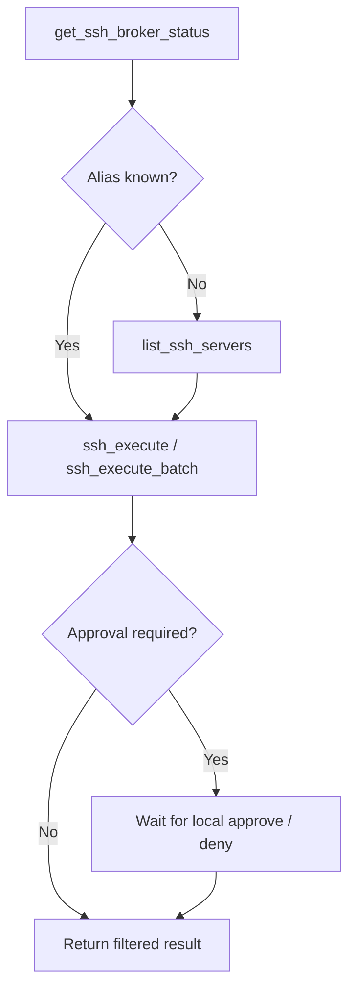

# Use Aegis SSH With Agents

> Connect Codex, Claude Code, Cursor, OpenClaw, and other MCP clients using public server aliases only.

[README](../README.md) · [Server setup](server-setup.md) · **Agent usage** · [Operations](operations.md) · [Security](../SECURITY.md) · [简体中文](agent-usage.zh-CN.md)

## Before you connect

| Check | Command |
| --- | --- |
| Broker is running and unlocked | `aegis-ssh status` |
| Public alias exists | `aegis-ssh server list` |
| MCP is registered in Codex | `codex mcp list` |

> [!CAUTION]
> Put only aliases and commands in Agent prompts. Never include connection fields, credentials, a master password, or a recovery code.

## Local approval and batching

Start the broker with `aegis-ssh start`; if a login service started it in locked state, run `aegis-ssh unlock`. In the default `enforce` mode a sensitive MCP call waits while the user handles the request in another local terminal:

```bash
aegis-ssh approval list
aegis-ssh approval show <id>
aegis-ssh approval approve <id>   # or: approval deny <id>
```

The agent is never asked to relay or confirm an approval code. Use `ssh_execute_batch` for one command across explicit aliases or all aliases; a risky batch is bound to one immutable target snapshot and needs one local approval.

This guide explains how an AI Agent uses Aegis SSH after one or more servers have been enrolled. Agents see only public aliases such as `prod`; password and private-key authentication are handled locally by the broker and are identical from the Agent's perspective.

## MCP And Skill

Aegis SSH provides two complementary integrations:

- **MCP is the tool transport.** It gives the Agent four callable tools for checking the broker, listing aliases, and executing commands on one or many aliases.
- **The Skill is behavioral guidance.** It tells a compatible Agent to use those MCP tools safely, address servers only by alias, wait for real user approval, and preserve redaction markers.

MCP is required for direct tool calls. The Skill is recommended but does not replace MCP. Clients without Skill support can still use Aegis SSH through MCP.

Server enrollment is deliberately not available through MCP. Run `aegis-ssh init`, `server add`, `server edit`, and `server remove` yourself in a real terminal so connection details and credentials are read only from `/dev/tty`. See [Add And Manage SSH Servers](server-setup.md).

## Codex Setup

Install the binary and Skill from the source tree or an extracted release archive:

```bash
scripts/install.sh --binary ./aegis-ssh --skill-dir "$HOME/.codex/skills"
```

When building from source, omit `--binary ./aegis-ssh`:

```bash
scripts/install.sh --skill-dir "$HOME/.codex/skills"
```

Register the MCP server with an absolute binary path:

```bash
codex mcp add aegis-ssh -- "$HOME/.local/bin/aegis-ssh" mcp
codex mcp list
```

Restart Codex after installing or updating the Skill or MCP configuration. A running Codex session may not discover changes made after it started.

## Start The Broker

Start and unlock the background broker before asking an Agent to connect:

```bash
aegis-ssh start
```

Enter the local master password at the hidden prompt. After startup the terminal can be closed. The MCP process communicates with this local broker and never receives the password.

Lock or stop the broker when finished:

```bash
aegis-ssh lock
aegis-ssh stop
```

## Ask The Agent

Refer only to a configured alias. Do not include an address, port, username, password, private key, passphrase, or fingerprint in the prompt.

Example prompts:

```text
Use Aegis SSH to list the configured servers.
Use Aegis SSH to run uptime on prod.
Use Aegis SSH to run `cd /srv/app && git status --short` on staging.
Use Aegis SSH to inspect disk usage on db-primary and summarize the result.
```

Equivalent Chinese prompts also work:

```text
使用 Aegis SSH 列出已经配置的服务器。
使用 Aegis SSH 在 prod 上执行 uptime。
使用 Aegis SSH 在 staging 上执行 `cd /srv/app && git status --short`。
```

Password and private-key servers are used in exactly the same way. The Agent does not need to know which authentication method an alias uses.

## Tool Flow

For a normal request, the Agent should use this flow:



The four MCP tools are:

| Tool | Purpose |
| --- | --- |
| `get_ssh_broker_status` | Check whether the daemon is reachable and the vault is unlocked. |
| `list_ssh_servers` | List public aliases, descriptions, and availability. |
| `ssh_execute` | Execute one exact non-interactive command through an alias. |
| `ssh_execute_batch` | Execute one command concurrently across explicit aliases or all aliases. |

## Approval Flow

Some commands can expose sensitive server information. The MCP call waits while a desktop notification directs the user to the local approval center:

```text
aegis-ssh approval list
aegis-ssh approval show <id>
aegis-ssh approval approve <id>  # or deny
```

No approval code is added to agent chat. Approvals expire after five minutes, are consumed once, and are bound to the original aliases, command, and execution limits. The Agent cannot approve on your behalf.

Command output is filtered even after approval. Keep every `[REDACTED:...]` marker and truncation warning as returned; do not ask the Agent to reconstruct hidden data.

## Other Agent Clients

All clients launch the same stdio command:

```text
$HOME/.local/bin/aegis-ssh mcp
```

Configuration examples are available in `examples/mcp/` for Claude Code, Cursor, and OpenClaw as well as Codex. Merge the matching example into that client's MCP configuration and use an absolute binary path when the client does not inherit your shell `PATH`. Restart the client after changing its configuration.

Clients that support reusable Skills can load `skills/aegis-ssh`. Clients without Skill support can rely on the MCP tool descriptions and the workflow in this guide.

## Troubleshooting

- MCP server is missing: verify `codex mcp list` or the equivalent client configuration, use the absolute binary path, and restart the client.
- `daemon: unavailable`: run `aegis-ssh start`.
- Vault is locked: run `aegis-ssh unlock` in a local terminal, never enter the master password in Agent conversation.
- Alias is missing: stop the daemon, run `aegis-ssh server add` in a real terminal, then restart the daemon.
- Authentication fails: stop the daemon and run `aegis-ssh server edit <alias>` to replace the password or private key.
- Approval fails: inspect pending requests with `aegis-ssh approval list` and retry the original request after an expiry.
- Output is redacted or truncated: this is an intentional disclosure boundary, not an MCP transport failure.

---

[Back to README](../README.md) · [Server setup](server-setup.md) · [Operations reference](operations.md)
