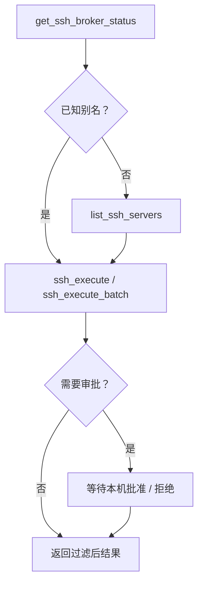

# 让 Agent 使用 Aegis SSH

> 使用公开服务器别名连接 Codex、Claude Code、Cursor、OpenClaw 和其他 MCP 客户端。

[项目首页](../README.zh-CN.md) · [服务器配置](server-setup.zh-CN.md) · **Agent 使用** · [运维](operations.zh-CN.md) · [安全](../SECURITY.zh-CN.md) · [English](agent-usage.md)

## 连接前检查

| 检查项 | 命令 |
| --- | --- |
| Broker 已运行并解锁 | `aegis-ssh status` |
| 公开别名已存在 | `aegis-ssh server list` |
| Codex 已注册 MCP | `codex mcp list` |

> [!CAUTION]
> Agent 提示词中只能出现别名和命令。不得包含连接信息、凭据、主密码或恢复码。

## 本机审批和批量执行

使用 `aegis-ssh start` 启动后台 broker；登录服务启动后处于锁定状态时，运行 `aegis-ssh unlock`。默认 `enforce` 模式下，敏感 MCP 调用会等待用户在另一个本机终端处理：

```bash
aegis-ssh approval list
aegis-ssh approval show <id>
aegis-ssh approval approve <id>   # 或 approval deny <id>
```

Agent 不再转述或确认批准码。相同命令要在多台服务器执行时使用 `ssh_execute_batch`；有风险的批量请求会固定目标别名快照，并只需一次本机审批。

本文介绍添加一台或多台服务器后，如何让 AI Agent 使用 Aegis SSH。Agent 只能看到 `prod` 之类的公开别名；密码认证和私钥认证都由本地 broker 处理，对 Agent 的使用方式完全相同。

## MCP 与 Skill 的关系

Aegis SSH 提供两种互补的 Agent 集成：

- **MCP 是实际的工具传输层。** Agent 通过四个 MCP 工具查询 broker、列出别名，以及对单个或多个别名执行命令。
- **Skill 是行为说明。** 它指导支持 Skill 的 Agent 优先使用 MCP、只通过别名访问服务器、等待用户真实批准，并保留脱敏标记。

Agent 要直接调用工具，必须配置 MCP。Skill 推荐安装，但不能替代 MCP。不支持 Skill 的客户端也可以只通过 MCP 使用 Aegis SSH。

出于机密隔离目的，MCP 不提供服务器添加或修改工具。请由用户在真实终端中执行 `aegis-ssh init`、`server add`、`server edit` 和 `server remove`，使连接信息和凭据只通过 `/dev/tty` 输入。完整流程见[添加和管理 SSH 服务器](server-setup.zh-CN.md)。

## 为 Codex 配置

在源码目录或解压后的 Release 目录中安装二进制文件和 Skill：

```bash
scripts/install.sh --binary ./aegis-ssh --skill-dir "$HOME/.codex/skills"
```

如果需要直接从源码构建，可以省略 `--binary ./aegis-ssh`：

```bash
scripts/install.sh --skill-dir "$HOME/.codex/skills"
```

使用二进制文件的绝对路径注册 MCP：

```bash
codex mcp add aegis-ssh -- "$HOME/.local/bin/aegis-ssh" mcp
codex mcp list
```

安装或更新 Skill、修改 MCP 配置后，请重新启动 Codex。已经运行的 Codex 会话不一定能发现启动后才发生的配置变化。

## 启动 Broker

要求 Agent 连接前，启动并解锁后台 broker：

```bash
aegis-ssh start
```

在隐藏提示中输入本地主密码。启动后可以关闭终端；MCP 进程只与本机 broker 通信，不会收到主密码。

使用结束后，停止 daemon 并清除内存中的凭据：

```bash
aegis-ssh lock
aegis-ssh stop
```

## 向 Agent 下达任务

提示词中只使用已经配置的别名，不要填写服务器地址、端口、用户名、密码、私钥、私钥口令或主机指纹。

中文示例：

```text
使用 Aegis SSH 列出已经配置的服务器。
使用 Aegis SSH 在 prod 上执行 uptime。
使用 Aegis SSH 在 staging 上执行 `cd /srv/app && git status --short`。
使用 Aegis SSH 检查 db-primary 的磁盘使用情况并总结结果。
```

英文示例：

```text
Use Aegis SSH to list the configured servers.
Use Aegis SSH to run uptime on prod.
Use Aegis SSH to run `cd /srv/app && git status --short` on staging.
```

密码服务器和私钥服务器的提示词完全相同。Agent 不需要知道某个别名使用哪种认证方式。

## 工具调用流程

正常请求应使用以下流程：



四个 MCP 工具分别是：

| 工具 | 用途 |
| --- | --- |
| `get_ssh_broker_status` | 检查 daemon 是否可访问、vault 是否已经解锁。 |
| `list_ssh_servers` | 列出公开别名、描述和可用状态。 |
| `ssh_execute` | 通过别名执行一条完整、非交互式命令。 |
| `ssh_execute_batch` | 在显式别名或全部别名上并发执行同一命令。 |

## 批准流程

有些命令可能暴露服务器敏感信息。MCP 调用会等待，桌面通知提示用户在本机审批中心处理：

```text
aegis-ssh approval list
aegis-ssh approval show <id>
aegis-ssh approval approve <id>  # 或 deny
```

审批信息不会进入 Agent 对话。审批五分钟过期、只能使用一次，并绑定原始别名快照、命令和执行限制；Agent 不能代替用户批准。

批准后，命令输出仍会经过过滤。必须原样保留所有 `[REDACTED:...]` 标记和截断警告，不得要求 Agent 还原隐藏内容。

## 其他 Agent 客户端

所有客户端都启动同一个 stdio 命令：

```text
$HOME/.local/bin/aegis-ssh mcp
```

`examples/mcp/` 提供 Codex、Claude Code、Cursor 和 OpenClaw 的配置示例。将对应示例合并到客户端的 MCP 配置；如果客户端不会继承 Shell 的 `PATH`，请使用二进制文件的绝对路径。修改配置后重新启动客户端。

支持可复用 Skill 的客户端可以加载 `skills/aegis-ssh`。不支持 Skill 的客户端可以依靠 MCP 工具说明和本文流程使用。

## 故障排查

- 找不到 MCP：检查 `codex mcp list` 或对应客户端配置，使用二进制绝对路径，然后重新启动客户端。
- 提示 `daemon: unavailable`：运行 `aegis-ssh start`。
- vault 未解锁：在本机终端运行 `aegis-ssh unlock`，绝不能在 Agent 对话中输入主密码。
- 找不到别名：停止 daemon，在真实终端中运行 `aegis-ssh server add`，然后重新启动 daemon。
- 认证失败：停止 daemon，运行 `aegis-ssh server edit <alias>` 替换密码或私钥。
- 审批失败：使用 `aegis-ssh approval list` 检查待办；过期后重新提出原始请求。
- 输出被脱敏或截断：这是主动设置的数据披露边界，不是 MCP 传输故障。

---

[返回项目首页](../README.zh-CN.md) · [服务器配置](server-setup.zh-CN.md) · [运维参考](operations.zh-CN.md)
